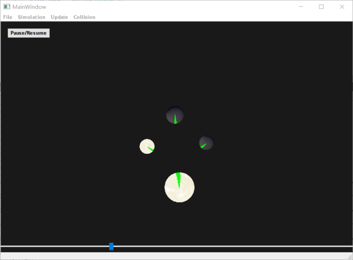

# Celestial Reverie

This is a C++ project with Qt + OpenGL for simulating the movement of celestial bodies in space. 

This project provides a base class for celestial bodies, a base class for update algorithms, and a base class for simulation algorithms, allowing the switching of different algorithms through template functions during simulation. It is easy to implement diverse celestial bodies and algorithms by inheriting the base classes. 

The library includes two types of celestial bodies: planets and stars; two update methods: forward Euler and implicit Euler; two simulation algorithms: brute-force and Barnes-Hut, along with parallel versions of these algorithms. Additionally, the library offers collision detection and celestial body merging functions based on octrees.

1. [Environment Setup](#environment-setup)
2. [GUI Manual](#gui-manual)
3. [Documentation](#documentation)


## Environment Setup

This project is developed using Qt Creator 5.0.2 (Qt 5.15.2 with MSVC 2019, 64-bit).  
Open the ```CelestialReverieLib.pro``` file in Qt Creator, and click ```Build``` in the lower-left corner to compile the Celestial simulation library. The compiled library file ```libCelestialReverieLib.a``` should be placed manually in the lib directory. This step has already been completed in the project.  
After completing the previous step, open the ```CelestialReverie.pro``` file in Qt Creator and click ```Build``` in the lower-left corner to compile and run the project. This compilation depends on the library file generated in the previous step. If you prefer not to use the encapsulated library file, you can manually edit the ```CelestialReverie.pro``` file and add the five files from ```src/simulation``` to the ```SOURCES``` variable.

## GUI Manual



This project uses Qt + OpenGL to interface with the celestial simulation library, providing a simple graphical user interface.  
- The ```File``` menu allows for saving and loading celestial systems.  
- The ```Simulation``` menu enables switching between different simulation algorithms.  
- The ```Update``` menu allows selecting the update algorithm and adjusting the time step.  
- The ```Collision``` menu toggles the collision merging feature for celestial bodies.  
- Clicking the ```Pause/Resume``` button will pause or resume the simulation.  
- Dragging the progress bar below allows for time jumping.  
- While the simulation is running, clicking on the rendering component with the mouse will switch to free camera view. In this mode, dragging the mouse will rotate the camera's viewpoint.  
- Pressing ```W/S/A/D/C/Space``` will move the camera forward, backward, left, right, up, or down.  
- Holding the ```Alt``` key will bring up the mouse cursor.  
- The green line on celestial bodies points in the direction of the net force they experience.

This project is inspired by [this guide](https://learnopengl-cn.github.io/07%20PBR/02%20Lighting/) and implements a basic version of Physics-Based Rendering. However, due to time constraints, features like ray collision detection and reflections were not implemented. Additionally, it incorporates the dynamic texture effect for the surface of stars, inspired by [this shader](https://www.shadertoy.com/view/dd2Xzm).  

## Documentation
```C++
class celestial_body
	//A basic celestial body class. It encapsulates the fundamental properties of a celestial body, such as mass, radius, position, velocity, acceleration, etc.
	double mass;
	glm::dvec3 position;
	glm::f64 &x = position.x;
	glm::f64 &y = position.y;
	glm::f64 &z = position.z;

	glm::dvec3 velocity;        //Linear velocity
    glm::f64 &vx = velocity.x;
    glm::f64 &vy = velocity.y;
    glm::f64 &vz = velocity.z;

    glm::dvec3 acceleration;    //Linear acceleration
    glm::f64 &ax = acceleration.x;
    glm::f64 &ay = acceleration.y;
    glm::f64 &az = acceleration.z;

    glm::dvec3 color; 
        // Color of the celestial body, used for simple rendering

	celestial_body(
		double mass = 0, 
		double radius = 0, 
		glm::dvec3 position = glm::dvec3(0), 
		glm::dvec3 velocity = glm::dvec3(0), 
        glm::dvec3 acceleration = glm::dvec3(0), 
        glm::dvec3 color = glm::dvec3(0.2, 0.2, 0.6)
    );
	    // The constructor’s parameters are self-explanatory.

	virtual celestial_body* duplicate() const;
	    // Copies the celestial body to new memory and returns its pointer.

	virtual std::ostream& operator<<(std::ostream& os) const;
		// Outputs the celestial body information in CSV format to the output stream.
		// The order is: celestial body type, mass, radius, position x/y/z components, velocity x/y/z components, acceleration x/y/z components, RGB color components (14 values in total). The celestial body type for celestial_body base class is 0, for planet class it is 1, and for star class it is 2.
		// For example:
			celestial_body* body = new celestial_body();
			*body << std::cout;  //Note that *body is an lvalue!
		// Output:
			0,0,0,0,0,0,0,0,0,0,0,0,0.2,0.2,0.6

	virtual bool is_emissive();
		// Returns whether the celestial body is emissive (self-luminous). By default, it does not emit light (false). Stars are emissive, planets are not.

class planet : public celestial_body 
	// The planet class. All properties and methods are the same as celestial_body, but it is placed on an equal footing with the star class.
	// When output, the celestial body type for the planet class is 1.

class star : public celestial_body
	// The star class. All properties and methods are the same as celestial_body, but stars are luminous.
	// When output, the celestial body type for the star class is 2.

class celestial_system 
	// A celestial system class.

	std::vector<celestial_body*> bodies;
		// Container to store celestial bodies
	celestial_system(double time = 0.0);
		// Constructor. The parameter 'time' represents the current time.

	~celestial_system();
		// Destructor.

	void add_body(celestial_body* body);
		// Adds a celestial body to the bodies vector.

	void del_body(celestial_body* body);
		// Deletes the specified celestial body from bodies.

	void set_time(double time);
		// Sets the current time (this does not change the states of celestial bodies).	

	double get_time();
		// Gets the current time of the celestial system.

	celestial_system* duplicate();
		// Deep copies the celestial system into new memory and returns its pointer.

	friend std::ostream& operator<<(std::ostream& os, celestial_system& system);
		// Outputs the celestial bodies in bodies in CSV format, similar to celestial_body's output.
		// Usage example:
			celestial_system* sys = ...;
			...;
			std::cout << *sys;
	
class simulate_algorithm
	// Base class for simulation algorithms. The library provides O(n2) brute-force update methods, O(n log n) Barnes-Hut approximation algorithms, and parallel versions of both.

	virtual void simulate(celestial_system*& system) = 0;
		// Recalculates the accelerations of all celestial bodies in the given system based on their positions.	

class pure_newtonian : public simulate_algorithm	
	// Uses the O(n^2) brute-force calculation to update the accelerations of celestial bodies. Written using the singleton pattern.

	virtual void simulate(celestial_system*& system) override;
		// Recalculates the accelerations of all celestial bodies in the given system based on their positions.	

	static simulate_algorithm& get_instance();
		// Gets the singleton instance.

class pure_newtonian_parallel : public pure_newtonian
	// Parallel version of pure_newtonian using OpenMP. It works the same way as pure_newtonian.

class barnes_hut : public simulate_algorithm
	// Uses the O(n log n) Barnes-Hut approximation algorithm to calculate the accelerations by building an octree. Written using the singleton pattern.

	virtual void simulate(celestial_system*& system) override;
		// Recalculates the accelerations of all celestial bodies in the given system based on their positions.
	
	static simulate_algorithm& get_instance();
		// Gets the singleton instance.

class barnes_hut_parallel : public barnes_hut
	// Parallel version of barnes_hut using OpenMP. It works the same way as barnes_hut.


class update_algorithm
	// Base class for update algorithms. Given a time step and the accumulated accelerations and velocities of celestial bodies in the system, it updates the positions and velocities of the bodies. The library provides forward Euler and implicit Euler methods.

	virtual void update(celestial_body*& body, double dt) = 0;
		// Updates the position and velocity of a single celestial body.	
	virtual void update(celestial_system*& system, double dt, simulate_algorithm*& sim) = 0;
		// Updates the positions and velocities of all celestial bodies in the system.

class forward_euler : public update_algorithm
	// Forward Euler method. Written using the singleton pattern.

	static forward_euler& get_instance();
		// Gets the singleton instance.

	void update(celestial_body*& body, double dt) = 0;
		// Updates the position and velocity of a single celestial body.	

	void update(celestial_system*& system, double dt, simulate_algorithm*& sim) = 0;
		// Updates the positions and velocities of all celestial bodies in the system.


class implicit_euler : public update_algorithm
	// Implicit Euler method. Written using the singleton pattern.

	static implicit_euler& get_instance();
		// Gets the singleton instance.

	void update(celestial_body*& body, double dt) = 0;
		// Updates the position and velocity of a single celestial body.	

	void update(celestial_system*& system, double dt, simulate_algorithm*& sim) = 0;
		// Updates the positions and velocities of all celestial bodies in the system.


class collision_detection
	// Base class for collision detection.

	static bool is_colliding(celestial_body* body1, celestial_body* body2);
		// Checks whether two celestial bodies are colliding, i.e., if their distance is less than the sum of their radii. 

	static celestial_body* merge(celestial_body* body1, celestial_body* body2);
		// This function requires both pointers are not null.
		Merges two celestial bodies into one and returns a pointer to the merged body. The mass is the sum of the masses, the color is the maximum of both, and the other properties are weighted averages based on mass. If one body is a star, the merged body will be a star, otherwise, it will be a base class celestial body.

	virtual void detect(celestial_system*& system) = 0;
		// Detect collisions in the celestial system and merge the colliding celestial bodies into a larger body.  
        // A single celestial body can only participate in one merge during a single collision detection. Each merge involves only two celestial bodies.

class dummy_detection : collision_detection
	// No collision detection occurs when this class is used. Written using the singleton pattern.

	virtual void detect(celestial_system*& sys) override;
		// No operation is performed in this function.

	static collision_detection& get_instance();
		// Gets the singleton instance.

class ocd : collision_detection
	// Octree-based collision detection, with time complexity of O(n log n). Written using the singleton pattern.

	virtual void detect(celestial_system*& sys) override;
		// Inherited function for performing collision detection.    	
	static collision_detection& get_instance();
		// Gets the singleton instance.


class celestial_reverie
	// Control class for the simulation.
	celestial_system* get_current_frame();
		// Gets the current frame (the corresponding celestial system).

	bool add_celestial_body(celestial_body* body);
		// Adds a celestial body to the current frame (called only at the start of the simulation).

	void set_time_step(double time_step);
		// Sets the time step for the simulation.

	void set_save_interval(double save_interval);
		// Sets the time interval for saving frames. During the simulation, every time the interval (simulation time, not real time) passes, the current frame will be copied and cached. When time is jumped, the nearest saved frame to the target time will be found using binary search, and the simulation will proceed from a copy of that frame to the target time.

	void clear_buffer(int size);
		// Clears the buffer of the last 'size' frames.

	void add_buffer();
		// Adds the current frame to the buffer (need to ensure the frame be the most recent).

	template<typename T>
	void set_simulate_algorithm()
		// Sets the simulation algorithm. The default is `barnes_hut`. The available options are pure_newtonian, barnes_hut, pure_newtonian_parallel, and barnes_hut_parallel.
		// Usage example:
			celestial_reverie sim;
			sim.set_simulate_algorithm<barnes_hut>();

	template<typename T>
	void set_update_algorithm()
		// Sets the update algorithm. The default is forward_euler. The available options are forward_euler and implicit_euler.
		// Usage example:
			celestial_reverie sim;
			sim.set_update_algorithm<forward_euler>();

	template<typename T>
	void set_collision_detection()
		// Sets the collision detection method. The default is dummy_detection. The available options are dummy_detection and ocd.
		// Usage example:
			celestial_reverie sim;
			sim.set_collision_detection<ocd>();

	celestial_system* simulate();
		// Advances and return the pointer of the the current frame by the time step according to the selected simulation, update and collision detection algorithms.

	celestial_system* back_to(double time);
		// Discards the current frame and jumps to the frame corresponding to the specified time.

	celestial_system* get_current_frame();
		// Gets the current frame.

```
